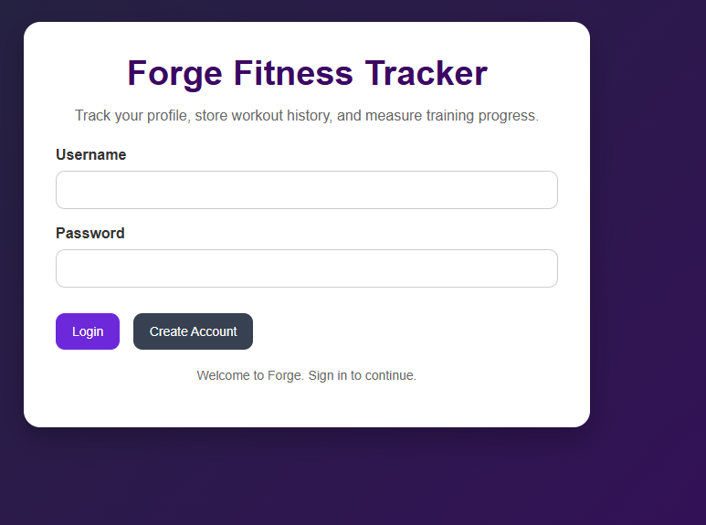
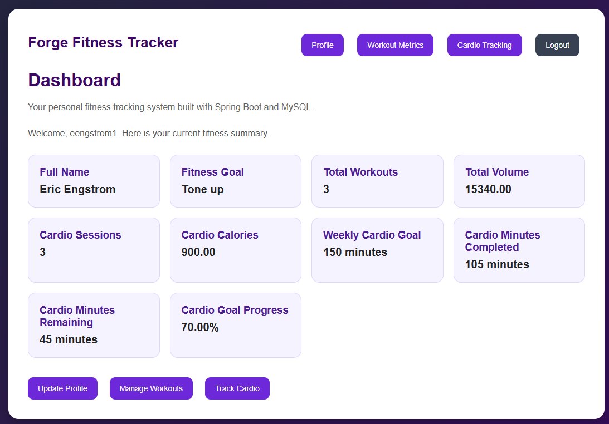
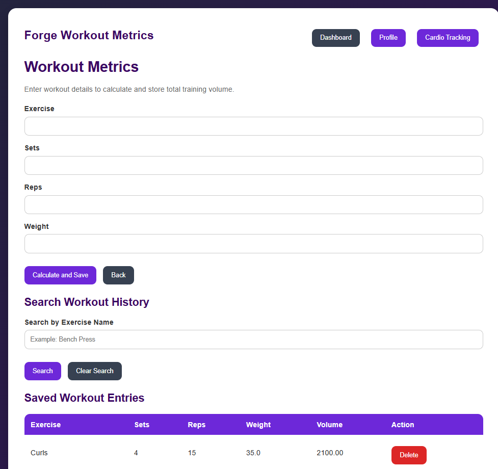
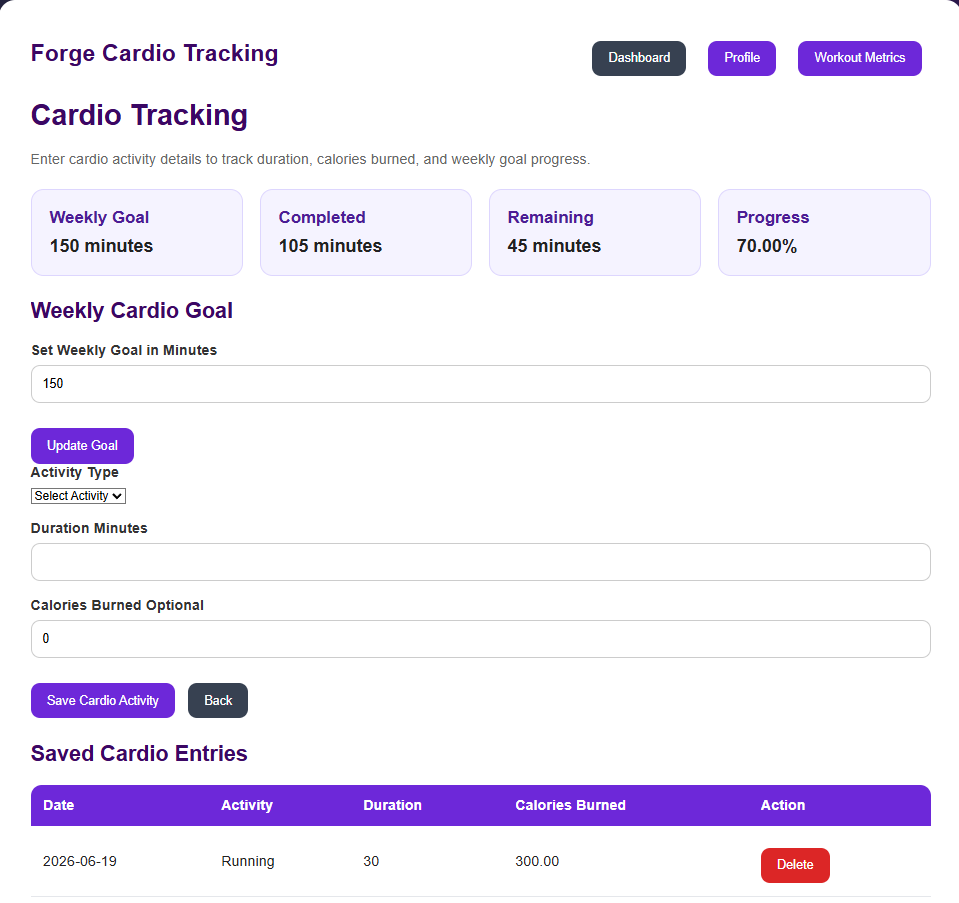

# Forge Fitness Tracker

## Eric Engstrom

### CST-452 Senior Project II

### Grand Canyon University

---

# Project Overview

Forge Fitness Tracker is a web-based fitness tracking application developed using Java, Spring Boot, Thymeleaf, and MySQL. The purpose of the application is to provide users with a centralized platform for managing fitness information, tracking workouts, recording cardio activities, setting fitness goals, and monitoring progress through an interactive dashboard.

The project was developed throughout the Senior Project sequence using an Agile-inspired development process consisting of planning, requirements analysis, architecture design, implementation, testing, and final release phases.

---

# Technologies Used

## Backend

* Java 17
* Spring Boot
* Spring Data JPA

## Frontend

* Thymeleaf
* HTML5
* CSS3

## Database

* MySQL

## Development Tools

* Spring Tool Suite (STS)
* Maven
* GitHub

---

# Key Features

### User Authentication

* Account registration
* User login
* Session management
* Logout functionality

### Profile Management

* Update personal information
* Track age, weight, and fitness goals
* Configure weekly cardio goals

### Workout Tracking

* Record exercise information
* Calculate workout volume automatically
* Search workout history by exercise name
* Delete workout records

### Cardio Tracking

* Record cardio activities
* Estimate calories burned
* Track activity duration
* Maintain cardio history

### Dashboard Reporting

* Total workouts completed
* Total workout volume
* Cardio session count
* Cardio calories burned
* Goal progress monitoring

---

# Application Screenshots

## Login Page

---

## Dashboard

---

## Workout Metrics

---

## Cardio Tracking

---

# Development Process

The project was completed through multiple development milestones.

### Milestone 1

Project planning and proposal development.

### Milestone 2

Requirements gathering and analysis.

### Milestone 3

System architecture design, database design, UML diagrams, flowcharts, and application planning.

### Milestone 4

Core application development including user authentication, profile management, workout tracking, and dashboard functionality.

### Milestone 5

Testing, validation, debugging, and feature enhancements.

### Milestone 6

Final application refinement, documentation updates, source code commenting, portfolio development, and project presentation.

---

# Challenges and Solutions

One of the most challenging aspects of development involved integrating multiple application modules while maintaining a consistent user experience.

Additional challenges included:

* Designing the database structure
* Implementing workout search functionality
* Creating dashboard summary calculations
* Integrating cardio tracking with user goals
* Managing data persistence across multiple features

These challenges were overcome through incremental development, continuous testing, debugging, and iterative improvements throughout the project lifecycle.

---

# Demonstration Video

## Project Demonstration Recording

The following videos demonstrate the completed Forge Fitness Tracker application, including the project overview, implementation approach, GUI functionality, application features, challenges encountered, and final system demonstration.

### Part 1 – Project Overview and Application Demonstration
[Watch Part 1](https://www.loom.com/share/3b32d9ce8a5e4c0f81daa9f8fbd0d755)

### Part 2 – Application Demonstration and Project Discussion
[Watch Part 2](https://www.loom.com/share/6466a5c642a14072b746db485606314b)

---

# Source Code Repository

**GitHub Repository**

The source code for Forge Fitness Tracker was maintained using GitHub throughout the development process and includes all project artifacts, source code, documentation, and milestone deliverables.

[View Source Code Repository](https://github.com/EENGSTROM1/SeniorProject/tree/Final)

---

# Christian Worldview Reflection

Throughout the development process, technical challenges required persistence, patience, and continuous problem solving. A Christian worldview emphasizes faithfulness, responsibility, and perseverance when facing obstacles. These principles helped guide the project through challenges and reinforced the importance of integrity, diligence, and commitment to producing quality work.

---

# Lessons Learned

This project provided valuable experience in:

* Full-stack web application development
* Java and Spring Boot development
* Database design and management
* Agile project planning
* Software testing and debugging
* Technical documentation
* Source control management using Git and GitHub

The experience strengthened both technical and project management skills while demonstrating the complete software development lifecycle from concept to deployment.

---

# Contact

Eric Engstrom

Grand Canyon University

CST-452 Senior Project II

June 21, 2026
